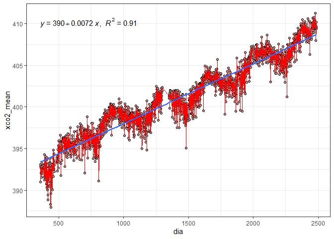
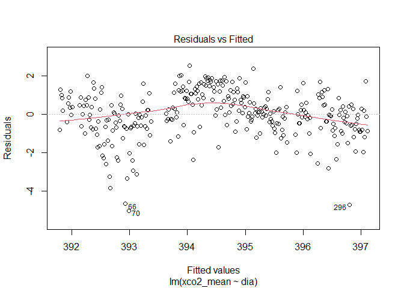
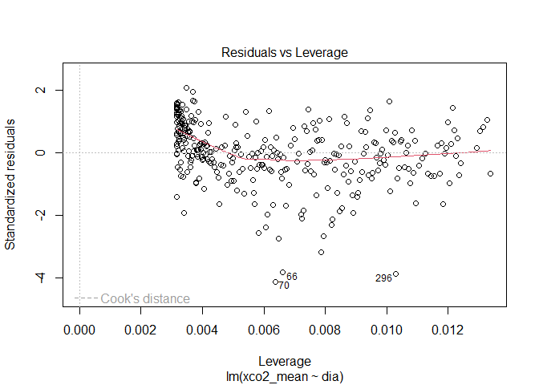
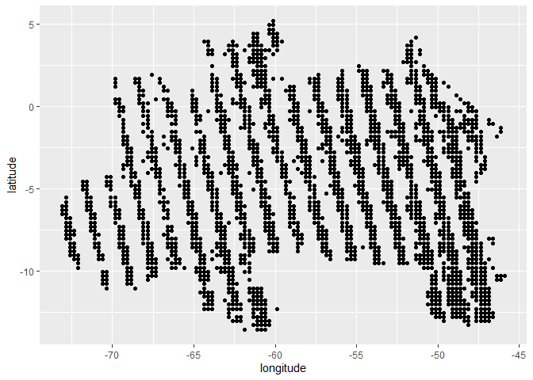

<!-- README.md is generated from README.Rmd. Please edit that file -->

# Determinação de fontes e sumidouros de carbono atmosférico no Brasil por meio da análise de regressão linear

### Aluno: Alan R. Panosso

### Data: 31/08/2021

Projeto final apresentado os instrutores Athos Damiani e Fernando Correa
da Curso-R como parte das exigências para a finalização do curso de
**Regressão Linear** (Trilha de Machine Learning - Turma Agosto 2021).

## Introdução

As concentrações atmosféricas de gases do efeito estufa (GEE) têm
aumentado a níveis preocupantes. De acordo com a **Organização
Meteorológica Mundial** (*WMO*) as concentrações atmosféricas de dióxido
de carbono (CO<sub>2</sub>), metano (CH<sub>4</sub>) e óxido nitroso
(N<sub>2</sub>O) atingiram novas máximas no ano de 2015 com
CO<sub>2</sub> a 400,0 ± 0,1 ppm, CH<sub>4</sub> em 1845 ± 2 ppb e
N<sub>2</sub>O em 328,0 ± 0,1 ppb, valores que representam,
respectivamente, 144%, 256% e 121% dos níveis pré-industriais ([WMO,
2016](http://ane4bf-datap1.s3-eu-west-1.amazonaws.com/wmocms/s3fs-public/GHG_Bulletin_12_EN_web_JN161640.pdf?aZaKZhdpDfJdmHvtbSvLwbj6zb_PWwdz)).

O Observatório Orbital de Carbono-2 (OCO-2) foi projetado pela **Agência
Espacial Americana** (*National Aeronautics and Space Administration -
NASA*) para apoiar a quantificação e o monitoramento das emissões
antropogênicas de CO<sub>2</sub>.

O satélite OCO-2 foi lançado em órbita em julho de 2014 e desde então
mede a concentração de CO<sub>2</sub> atmosférico indiretamente por meio
da intensidade da radiação solar refletida em função da presença de
dióxido de carbono em uma coluna de ar. Essas medições resultam em mapas
espaciais densos e em escala fina de frações molares médias de coluna de
ar seco de dióxido de carbono (X<sub>CO2</sub>).

Nesse contexto, a variação de X<sub>CO2</sub> opode ser modelada por
meio da **análise de regressão linear simples**, uma vez que se espera
um aumento dessas concentrações com o passar do tempo. Em adição, as
estimativas do coeficiente angular **β<sub>1</sub>** fornece informações
importantes para uma determinada região, haja visto que se
**β<sub>1</sub>’** (observado para essa região) for significativamente
maior ao **β<sub>1</sub>** padrão (observado para uma macro-região), tal
área poderá ser considerada uma potencial fonte de carbono para a
atmosfera, caso contrário (**β<sub>1</sub>’** &lt; **β<sub>1</sub>**), a
área em questão poderá ser considerada um sumidouro de CO<sub>2</sub>
atmosférico, mitigando o efeito estufa adicional e, consequentemente, as
mudanças climáticas globais.

## Hipótese e objetivo

A hipótese do projeto é que essa tendência de aumento da concentração
atmosférica de CO<sub>2</sub> pode ser utilizada como um indicativo para
a classificação de áreas como fontes e sumidouros de CO<sub>2</sub>
utilizando as estimativas de **β<sub>1</sub>** provenientes da análise
de regressão linear simples.

## Material e Métodos

Para a aquisição de dados será utilizado metodologia desenvolvida e
apresentada anteriormente no curso de R para Ciências de dados 2,
ministrados pela Curso-r ([Projeto Final
r4ds2](https://github.com/arpanosso/projetofinal_r4ds2)), onde foram
utilizadas técnicas de *web scraping* e **faxina de dados** para
obtenção dos valores de X<sub>CO2</sub>.

Breve descrição das variáveis da base:

**longitude**: coordenada geográfica que especifica a posição
leste-oeste de um ponto na superfície da Terra;

**longitude\_bnds**: são, respectivamente, os limites superior e
inferior da coordenada, onde a **longitude** para um ponto foi dada pela
média desses limites;

**latitude**: é uma coordenada geográfica que especifica a posição
norte-sul de um ponto na superfície da Terra;

**latitude\_bnds**: são, respectivamente, os limites superior e inferior
da coordenada, onde a **latitude** para um ponto foi dada pela média
desses limites;

**time\_yyyymmddhhmmss**: data de leitura, em ano, mês, dia, horas
minutos e segundos;

**time\_bnds\_yyyymmddhhmmss**: limites de tempo utilizados para o
cálculo da data de leitura;

**altitude\_km**: altitude média em km;

**alt\_bnds\_km**: limites da altitude, 0 (nível do mar) e altitude do
satélite no momento de leitura;

**fluorescence\_offset\_relative\_771nm\_idp**: Fração de radiância de
nível contínuo explicada por um termo de deslocamento aditivo na janela
espectral de 757 nm (sem unidade);

**fluorescence\_offset\_relative\_757nm\_idp**: Fração da radiância de
nível contínuo explicada por um termo de deslocamento aditivo na janela
espectral de 771 nm (sem unidade);

**xco2\_moles\_mole\_1**: Fração molar de ar seco de CO<sub>2</sub> em
média da coluna.

``` r
oco2 <- readr::read_rds("data/oco2.rds")
dplyr::glimpse(oco2)
#> Rows: 361,615
#> Columns: 11
#> $ longitude                              <dbl> -74.58225, -74.58225, -74.58225~
#> $ longitude_bnds                         <chr> "-74.70703125:-74.4574652778", ~
#> $ latitude                               <dbl> -30.22572489, -29.97654828, -29~
#> $ latitude_bnds                          <chr> "-30.3503131952:-30.1011365845"~
#> $ time_yyyymmddhhmmss                    <dbl> 2.014091e+13, 2.014091e+13, 2.0~
#> $ time_bnds_yyyymmddhhmmss               <chr> "20140909000000:20140910000000"~
#> $ altitude_km                            <dbl> 3307.8, 3307.8, 3307.8, 3307.8,~
#> $ alt_bnds_km                            <chr> "0.0:6615.59960938", "0.0:6615.~
#> $ fluorescence_offset_relative_771nm_idp <dbl> 0.012406800, 0.010696600, -0.00~
#> $ fluorescence_offset_relative_757nm_idp <dbl> -3.58630e+00, 8.81219e-02, -3.6~
#> $ xco2_moles_mole_1                      <dbl> 0.000394333, 0.000395080, 0.000~
```

Será necessário transformar os dados de X<sub>CO2</sub>, para ppm em
seguida criar as variáveis de data a partir da variável
`time_yyyymmddhhmmss`.

``` r
oco2<-oco2 |>
         dplyr::mutate(
           xco2 = xco2_moles_mole_1*1e06,
           data = lubridate::ymd_hms(time_yyyymmddhhmmss),
           year = lubridate::year(data),
           month = lubridate::month(data),
           day = lubridate::day(data),
           day_week = lubridate::wday(data),
           month_year = lubridate::make_date(year, month, 1) )
```

Existe uma tendência de aumento monotônica mundial da concentração de
CO<sub>2</sub> na atmosfera, assim, ela deve ser modelada para obtermos
**β<sub>1</sub>** para ser considerado o padrão para comparação às
tendências regionais. Devido à periodicidade de retorno do satélite em
um ponto (ao redor de 16 dias) os dados serão agrupados pelo mês dentro
de um determinado ano.

``` r
oco2 |> 
  dplyr::group_by(month_year) |> 
  dplyr::summarise(xco2_mean = mean(xco2, na.rm =TRUE)) |> 
  ggplot2::ggplot(ggplot2::aes(x=month_year,y=xco2_mean )) +
  ggplot2::geom_point(shape=21,color="black",fill="gray") +
  ggplot2::geom_line(color="red") +
  ggplot2::geom_smooth(method = "lm") +
  ggpubr::stat_regline_equation(ggplot2::aes(
  label =  paste(..eq.label.., ..rr.label.., sep = "*plain(\",\")~~"))) +
  ggplot2::theme_bw()
```

<!-- -->

Para ajustar o modelo linear, usamos `lm()`.

``` r
oco2_aux <- oco2 |> 
  dplyr::group_by(month_year) |> 
  dplyr::summarise(xco2_mean = mean(xco2, na.rm =TRUE))
mod <- lm(xco2_mean ~ month_year, data = oco2_aux)
summary(mod)
#> 
#> Call:
#> lm(formula = xco2_mean ~ month_year, data = oco2_aux)
#> 
#> Residuals:
#>      Min       1Q   Median       3Q      Max 
#> -1.95575 -0.76668  0.08538  0.72116  2.02737 
#> 
#> Coefficients:
#>              Estimate Std. Error t value Pr(>|t|)    
#> (Intercept) 2.748e+02  3.008e+00   91.34   <2e-16 ***
#> month_year  7.222e-03  1.725e-04   41.86   <2e-16 ***
#> ---
#> Signif. codes:  0 '***' 0.001 '**' 0.01 '*' 0.05 '.' 0.1 ' ' 1
#> 
#> Residual standard error: 0.9648 on 71 degrees of freedom
#> Multiple R-squared:  0.9611, Adjusted R-squared:  0.9605 
#> F-statistic:  1752 on 1 and 71 DF,  p-value: < 2.2e-16
```

``` r
b1 <- 7.222e-03
b1li <- b1 - 1.725e-04 
b1ls <- b1 + 1.725e-04 
```

``` r
broom::augment(mod)
#> # A tibble: 73 x 8
#>    xco2_mean month_year .fitted   .resid   .hat .sigma     .cooksd .std.resid
#>        <dbl> <date>       <dbl>    <dbl>  <dbl>  <dbl>       <dbl>      <dbl>
#>  1      393. 2014-09-01    393.  0.322   0.0532  0.971 0.00331        0.343  
#>  2      393. 2014-10-01    393.  0.00218 0.0511  0.972 0.000000145    0.00232
#>  3      392. 2014-11-01    393. -0.847   0.0490  0.966 0.0208        -0.900  
#>  4      392. 2014-12-01    393. -0.819   0.0470  0.967 0.0186        -0.870  
#>  5      392. 2015-01-01    393. -1.06    0.0450  0.963 0.0300        -1.13   
#>  6      392. 2015-02-01    394. -1.48    0.0431  0.955 0.0554        -1.57   
#>  7      392. 2015-03-01    394. -1.96    0.0414  0.942 0.0925        -2.07   
#>  8      393. 2015-04-01    394. -1.08    0.0396  0.963 0.0268        -1.14   
#>  9      394. 2015-05-01    394.  0.0854  0.0379  0.972 0.000160       0.0902 
#> 10      395. 2015-06-01    395.  0.846   0.0362  0.966 0.0150         0.893  
#> # ... with 63 more rows
broom::augment(mod, interval="confidence")
#> # A tibble: 73 x 10
#>    xco2_mean month_year .fitted .lower .upper   .resid   .hat .sigma     .cooksd
#>        <dbl> <date>       <dbl>  <dbl>  <dbl>    <dbl>  <dbl>  <dbl>       <dbl>
#>  1      393. 2014-09-01    393.   392.   393.  0.322   0.0532  0.971 0.00331    
#>  2      393. 2014-10-01    393.   392.   393.  0.00218 0.0511  0.972 0.000000145
#>  3      392. 2014-11-01    393.   393.   393. -0.847   0.0490  0.966 0.0208     
#>  4      392. 2014-12-01    393.   393.   394. -0.819   0.0470  0.967 0.0186     
#>  5      392. 2015-01-01    393.   393.   394. -1.06    0.0450  0.963 0.0300     
#>  6      392. 2015-02-01    394.   393.   394. -1.48    0.0431  0.955 0.0554     
#>  7      392. 2015-03-01    394.   394.   394. -1.96    0.0414  0.942 0.0925     
#>  8      393. 2015-04-01    394.   394.   395. -1.08    0.0396  0.963 0.0268     
#>  9      394. 2015-05-01    394.   394.   395.  0.0854  0.0379  0.972 0.000160   
#> 10      395. 2015-06-01    395.   394.   395.  0.846   0.0362  0.966 0.0150     
#> # ... with 63 more rows, and 1 more variable: .std.resid <dbl>
plot(mod)
```

<!-- --><!-- --><!-- --><!-- -->

``` r
# cooks.distance(mod)
```

A próxima operação é selecionarmos na base de dados somente os pontos
pertencentes ao território brasileiro. Assim vamos utilizar o pacote
`{geobr}` para criarmos o filtro a partir dos polígonos das diferentes
regiões do Brasil.

``` r
regiao <- geobr::read_region(showProgress = FALSE)
#> Loading required namespace: sf
#> Using year 2010
br <- geobr::read_country(showProgress = FALSE)
#> Using year 2010
```

Agora podemos extrair os polígonos

``` r
### Polígono Brasil
pol_br <- br$geom |> purrr::pluck(1) |> as.matrix()

### Polígonos das Regiões
pol_norte <- regiao$geom |> purrr::pluck(1) |> as.matrix()
pol_nordeste <- regiao$geom |> purrr::pluck(2) |> as.matrix()
pol_sudeste <- regiao$geom |> purrr::pluck(3) |> as.matrix()
pol_sul <- regiao$geom |> purrr::pluck(4) |> as.matrix()
pol_centroeste<- regiao$geom |> purrr::pluck(5) |> as.matrix()
```

Plot de todos os pontos.

``` r
br |>
  ggplot2::ggplot() +
  ggplot2::geom_sf(fill="#2D3E50", color="#FEBF57",
          size=.15, show.legend = FALSE) +
  ggplot2::geom_point(data=oco2 |> dplyr::filter(year == 2014) ,
             ggplot2::aes(x=longitude,y=latitude),
             shape=3,
             col="red",
             alpha=0.2)
```

<!-- -->

``` r
oco2_br <- readr::read_rds("data/oco2_br.rds")
```

``` r
oco2_nest <- oco2_br |>
  tibble::as_tibble() |> 
  dplyr::mutate(quarter = lubridate::quarter(data),
                quarter_year = lubridate::make_date(year, quarter, 1)) |>  
  tidyr::pivot_longer(
    starts_with("flag"),
    names_to = "region",
    values_to = "flag"
  ) |> 
  dplyr::filter(flag) |> 
  dplyr::mutate(region = stringr::str_remove(region,"flag_")) |> 
  dplyr::group_by(region, longitude, latitude, quarter_year) |> 
  dplyr::summarise(xco2_mean = mean(xco2, na.rm=TRUE)) |> 
  dplyr::mutate(
    regi = region,
    id_time = quarter_year
  ) |> 
  dplyr::group_by(region, latitude, longitude) |> 
  tidyr::nest() 
#> `summarise()` has grouped output by 'region', 'longitude', 'latitude'. You can override using the `.groups` argument.
```

``` r
plot_extractor<- function(df){
  df |> 
    ggplot2::ggplot(ggplot2::aes(x=quarter_year,y=xco2_mean)) +
    ggplot2::geom_point()
}; plot_extractor(oco2_nest$data[[1]])
```

<!-- -->

``` r
beta1_extractor<- function(df){
  modelo <- lm(xco2_mean ~ quarter_year, data=df)
  beta_1 <- c(summary(modelo)$coefficients[2])
  if(is.nan(beta_1)) beta_1 <- 0
  return(beta_1)
}; beta1_extractor(oco2_nest$data[[1]])
#> [1] 0.005056673

ep_extractor <- function(df){
  modelo <- lm(xco2_mean ~ quarter_year, data=df)
  beta_1 <- summary(modelo)$coefficients[2]
  if(is.nan(beta_1)){
    ep <- 0
  } else {
    ep <- summary(modelo)$coefficients[2,2]
  }
  return(ep)
}; ep_extractor(oco2_nest$data[[1]])
#> [1] 0.001523023

pvalue_extractor <- function(df){
  modelo <- lm(xco2_mean ~ quarter_year, data=df)
  beta_1 <- summary(modelo)$coefficients[2]
  if(is.nan(beta_1)){
    p <- 1
  } else {
    p <- summary(modelo)$coefficients[2,4]
    if(is.nan(p)) p <- 1
  }
  return(p)
}; pvalue_extractor(oco2_nest$data[[3]])
#> [1] 1.128489e-06

for(i in 100:200){
  print(paste0(i, ": ",pvalue_extractor(oco2_nest$data[[i]])))
}
#> [1] "100: 0.113747451417962"
#> [1] "101: 0.37265467962619"
#> [1] "102: 0.436998914019986"
#> [1] "103: 0.76154670663007"
#> [1] "104: 1"
#> [1] "105: 0.0757004417246969"
#> [1] "106: 0.0160629006719308"
#> [1] "107: 1"
#> [1] "108: 0.13848222557524"
#> [1] "109: 0.132323185594749"
#> [1] "110: 0.00242693046726438"
#> [1] "111: 0.0136665180509469"
#> [1] "112: 5.54753253091103e-05"
#> [1] "113: 1.48346634908495e-07"
#> [1] "114: 3.08904119572612e-08"
#> [1] "115: 9.01033965050494e-08"
#> [1] "116: 1.12922391812128e-05"
#> [1] "117: 0.00294991162591553"
#> [1] "118: 0.00112723289918183"
#> [1] "119: 0.0785934779596562"
#> [1] "120: 0.000157666097333164"
#> [1] "121: 0.000805384962129368"
#> [1] "122: 0.157498924015466"
#> [1] "123: 1"
#> [1] "124: 1"
#> [1] "125: 0.0995696284314698"
#> [1] "126: 0.773217185414964"
#> [1] "127: 0.00409302853025832"
#> [1] "128: 0.0016975067327622"
#> [1] "129: 0.0277167378575894"
#> [1] "130: 0.13218434013465"
#> [1] "131: 0.556387185559503"
#> [1] "132: 0.0358053307556141"
#> [1] "133: 0.00602931537690356"
#> [1] "134: 0.000192213100489937"
#> [1] "135: 4.69226801411901e-06"
#> [1] "136: 3.22620408075559e-09"
#> [1] "137: 1.25530466788776e-05"
#> [1] "138: 1.34851368152652e-08"
#> [1] "139: 5.86890904382252e-10"
#> [1] "140: 6.87675435655739e-09"
#> [1] "141: 7.95644727803148e-07"
#> [1] "142: 1.79620708885998e-05"
#> [1] "143: 0.0129217831371734"
#> [1] "144: 0.0640281042323971"
#> [1] "145: 1"
#> [1] "146: 1"
#> [1] "147: 1"
#> [1] "148: 1"
#> [1] "149: 1"
#> [1] "150: 0.0106916058733338"
#> [1] "151: 1"
#> [1] "152: 0.0436758042845243"
#> [1] "153: 0.0467159340685007"
#> [1] "154: 0.0048507354190377"
#> [1] "155: 0.00345283611575425"
#> [1] "156: 0.000673081130234879"
#> [1] "157: 0.00430454680201759"
#> [1] "158: 1.20312382575275e-06"
#> [1] "159: 1.13884517347702e-05"
#> [1] "160: 3.83119572464955e-06"
#> [1] "161: 1.60797907844021e-08"
#> [1] "162: 1.36639308318079e-10"
#> [1] "163: 4.69782370722617e-09"
#> [1] "164: 1.44624215615715e-06"
#> [1] "165: 0.00095131258422156"
#> [1] "166: 0.022637104986633"
#> [1] "167: 1"
#> [1] "168: 1"
#> [1] "169: 1"
#> [1] "170: 1"
#> [1] "171: 1"
#> [1] "172: 0.0727650376753845"
#> [1] "173: 9.96015442057944e-05"
#> [1] "174: 1"
#> [1] "175: 1"
#> [1] "176: 1"
#> [1] "177: 1"
#> [1] "178: 0.0798481515215461"
#> [1] "179: 9.90868286821968e-06"
#> [1] "180: 1.15047192152717e-07"
#> [1] "181: 6.17667742999987e-10"
#> [1] "182: 1.22521680819714e-08"
#> [1] "183: 2.51167153121982e-08"
#> [1] "184: 5.039088010038e-06"
#> [1] "185: 3.11599304732984e-05"
#> [1] "186: 0.00303910193302764"
#> [1] "187: 0.00232157833613351"
#> [1] "188: 0.0618289192428814"
#> [1] "189: 1"
#> [1] "190: 1"
#> [1] "191: 1"
#> [1] "192: 1"
#> [1] "193: 1"
#> [1] "194: 1"
#> [1] "195: 0.043857031030586"
#> [1] "196: 1"
#> [1] "197: 1"
#> [1] "198: 0.0393447420431683"
#> [1] "199: 0.204116509402739"
#> [1] "200: 0.0465891428410531"

oco2_nest <- oco2_nest |> 
  dplyr::mutate( 
    beta1 = purrr::map(data,beta1_extractor),
    dpb = purrr::map(data,ep_extractor),
    p_value = purrr::map(data,pvalue_extractor),
    plots = purrr::map(data,plot_extractor)
  )

oco2_nest$plots[[13]]
```

<!-- -->

``` r
oco2_nest |> 
  dplyr::filter(region == "centroeste") |> 
  dplyr::filter(p_value < 0.05) |> 
  dplyr::mutate(class = ifelse(beta1 > b1ls,
                               "fonte",ifelse(beta1 < b1li, "sumidouro", "nulo"))
                ) |> 
  dplyr::select(longitude, latitude, class) |> 
  ggplot2::ggplot(ggplot2::aes(x=longitude, y=latitude, color = class)) +
  ggplot2::geom_point()
#> Adding missing grouping variables: `region`
```

<!-- -->

``` r
oco2_nest |> 
  dplyr::filter(region == "nordeste") |> 
  dplyr::mutate(class = ifelse(beta1 > 7.222e-03, "fonte", "sumidouro")) |> 
  dplyr::select(longitude, latitude, class) |> 
  ggplot2::ggplot(ggplot2::aes(x=longitude, y=latitude, color = class)) +
  ggplot2::geom_point()
#> Adding missing grouping variables: `region`
```

<!-- -->

``` r
oco2_nest |> 
  dplyr::filter(region == "centroeste") |> 
  dplyr::mutate(class = ifelse(beta1 > 7.222e-03, "fonte", "sumidouro")) |> 
  dplyr::select(longitude, latitude, class) |> 
  ggplot2::ggplot(ggplot2::aes(x=longitude, y=latitude, color = class)) +
  ggplot2::geom_point()
#> Adding missing grouping variables: `region`
```

<!-- -->

``` r
oco2_nest |> 
  dplyr::filter(region == "sudeste") |> 
  dplyr::mutate(class = ifelse(beta1 > 7.222e-03, "fonte", "sumidouro")) |> 
  dplyr::select(longitude, latitude, class) |> 
  ggplot2::ggplot(ggplot2::aes(x=longitude, y=latitude, color = class)) +
  ggplot2::geom_point()
#> Adding missing grouping variables: `region`
```

<!-- -->

``` r
oco2_nest |> 
  dplyr::filter(region == "sul") |> 
  dplyr::mutate(class = ifelse(beta1 > 7.222e-03, "fonte", "sumidouro")) |> 
  dplyr::select(longitude, latitude, class) |> 
  ggplot2::ggplot(ggplot2::aes(x=longitude, y=latitude, color = class)) +
  ggplot2::geom_point()
#> Adding missing grouping variables: `region`
```

<!-- -->
