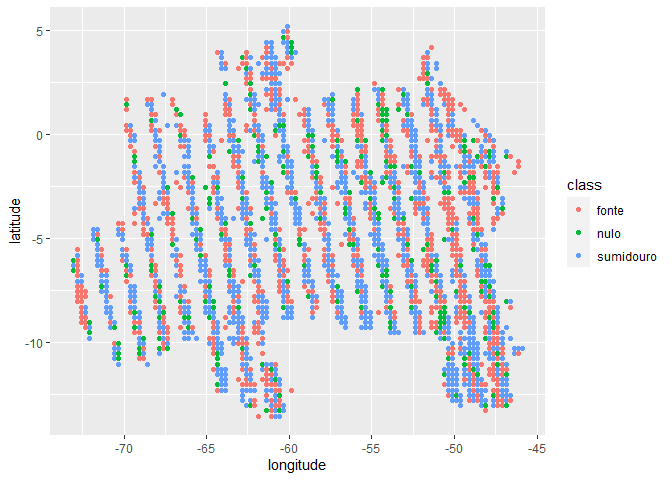
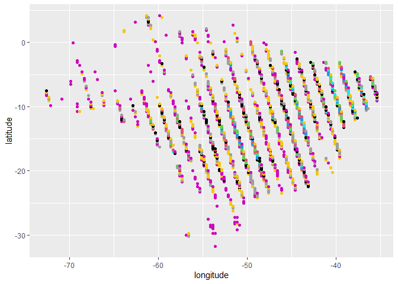

<!-- README.md is generated from README.Rmd. Please edit that file -->

# Determinação de fontes e sumidouros de carbono atmosférico no Brasil por meio da análise de regressão linear

### Aluno: Alan R. Panosso

### Data: 31/08/2021

Projeto final apresentado os instrutores Athos Damiani e Fernando Correa
da Curso-R como parte das exigências para a finalização do curso de
**Regressão Linear** (Trilha de Machine Learning - Turma Agosto 2021).

## Introdução

As concentrações atmosféricas de gases do efeito estufa (GEE) têm
aumentado a níveis preocupantes. De acordo com a **Organização
Meteorológica Mundial** (*WMO*) as concentrações atmosféricas de dióxido
de carbono (CO<sub>2</sub>), metano (CH<sub>4</sub>) e óxido nitroso
(N<sub>2</sub>O) atingiram novas máximas no ano de 2015 com
CO<sub>2</sub> a 400,0 ± 0,1 ppm, CH<sub>4</sub> em 1845 ± 2 ppb e
N<sub>2</sub>O em 328,0 ± 0,1 ppb, valores que representam,
respectivamente, 144%, 256% e 121% dos níveis pré-industriais ([WMO,
2016](http://ane4bf-datap1.s3-eu-west-1.amazonaws.com/wmocms/s3fs-public/GHG_Bulletin_12_EN_web_JN161640.pdf?aZaKZhdpDfJdmHvtbSvLwbj6zb_PWwdz)).

O Observatório Orbital de Carbono-2 (OCO-2) foi projetado pela **Agência
Espacial Americana** (*National Aeronautics and Space Administration -
NASA*) para apoiar a quantificação e o monitoramento das emissões
antropogênicas de CO<sub>2</sub>.

O satélite OCO-2 foi lançado em órbita em julho de 2014 e desde então
mede a concentração de CO<sub>2</sub> atmosférico indiretamente por meio
da intensidade da radiação solar refletida em função da presença de
dióxido de carbono em uma coluna de ar. Essas medições resultam em mapas
espaciais densos e em escala fina de frações molares médias de coluna de
ar seco de dióxido de carbono (X<sub>CO2</sub>).

Nesse contexto, a variação de X<sub>CO2</sub> opode ser modelada por
meio da **análise de regressão linear simples**, uma vez que se espera
um aumento dessas concentrações com o passar do tempo. Em adição, as
estimativas do coeficiente angular **β<sub>1</sub>** fornece informações
importantes para uma determinada região, haja visto que se
**β<sub>1</sub>’** (observado para essa região) for significativamente
maior ao **β<sub>1</sub>** padrão (observado para uma macro-região), tal
área poderá ser considerada uma potencial fonte de carbono para a
atmosfera, caso contrário (**β<sub>1</sub>’** &lt; **β<sub>1</sub>**), a
área em questão poderá ser considerada um sumidouro de CO<sub>2</sub>
atmosférico, mitigando o efeito estufa adicional e, consequentemente, as
mudanças climáticas globais.

## Hipótese e objetivo

A hipótese do projeto é que essa tendência de aumento da concentração
atmosférica de CO<sub>2</sub> pode ser utilizada como um indicativo para
a classificação de áreas como **fontes** ou **sumidouros** de
CO<sub>2</sub> utilizando as estimativas de **β<sub>1</sub>**
provenientes da análise de regressão linear simples.

## Material e Métodos

Para a aquisição de dados será utilizado metodologia desenvolvida e
apresentada anteriormente no curso de R para Ciências de dados 2,
ministrados pela Curso-r ([Projeto Final
r4ds2](https://github.com/arpanosso/projetofinal_r4ds2)), onde foram
utilizadas técnicas de *web scraping* e **faxina de dados** para
obtenção dos valores de X<sub>CO2</sub>.

Breve descrição das variáveis da base:

**longitude**: coordenada geográfica que especifica a posição
leste-oeste de um ponto na superfície da Terra;

**longitude\_bnds**: são, respectivamente, os limites superior e
inferior da coordenada, onde a **longitude** para um ponto foi dada pela
média desses limites;

**latitude**: é uma coordenada geográfica que especifica a posição
norte-sul de um ponto na superfície da Terra;

**latitude\_bnds**: são, respectivamente, os limites superior e inferior
da coordenada, onde a **latitude** para um ponto foi dada pela média
desses limites;

**time\_yyyymmddhhmmss**: data de leitura, em ano, mês, dia, horas
minutos e segundos;

**time\_bnds\_yyyymmddhhmmss**: limites de tempo utilizados para o
cálculo da data de leitura;

**altitude\_km**: altitude média em km;

**alt\_bnds\_km**: limites da altitude, 0 (nível do mar) e altitude do
satélite no momento de leitura;

**fluorescence\_offset\_relative\_771nm\_idp**: Fração de radiância de
nível contínuo explicada por um termo de deslocamento aditivo na janela
espectral de 757 nm (sem unidade);

**fluorescence\_offset\_relative\_757nm\_idp**: Fração da radiância de
nível contínuo explicada por um termo de deslocamento aditivo na janela
espectral de 771 nm (sem unidade);

**xco2\_moles\_mole\_1**: Fração molar de ar seco de CO<sub>2</sub> em
média da coluna.

``` r
oco2 <- readr::read_rds("data/oco2.rds")
dplyr::glimpse(oco2)
#> Rows: 361,615
#> Columns: 11
#> $ longitude                              <dbl> -74.58225, -74.58225, -74.58225~
#> $ longitude_bnds                         <chr> "-74.70703125:-74.4574652778", ~
#> $ latitude                               <dbl> -30.22572489, -29.97654828, -29~
#> $ latitude_bnds                          <chr> "-30.3503131952:-30.1011365845"~
#> $ time_yyyymmddhhmmss                    <dbl> 2.014091e+13, 2.014091e+13, 2.0~
#> $ time_bnds_yyyymmddhhmmss               <chr> "20140909000000:20140910000000"~
#> $ altitude_km                            <dbl> 3307.8, 3307.8, 3307.8, 3307.8,~
#> $ alt_bnds_km                            <chr> "0.0:6615.59960938", "0.0:6615.~
#> $ fluorescence_offset_relative_771nm_idp <dbl> 0.012406800, 0.010696600, -0.00~
#> $ fluorescence_offset_relative_757nm_idp <dbl> -3.58630e+00, 8.81219e-02, -3.6~
#> $ xco2_moles_mole_1                      <dbl> 0.000394333, 0.000395080, 0.000~
```

Será necessário transformar os dados de X<sub>CO2</sub>, para ppm em
seguida criar as variáveis de data a partir da variável
`time_yyyymmddhhmmss`.

``` r
oco2<-oco2 |>
         dplyr::mutate(
           xco2 = xco2_moles_mole_1*1e06,
           data = lubridate::ymd_hms(time_yyyymmddhhmmss),
           year = lubridate::year(data),
           month = lubridate::month(data),
           day = lubridate::day(data),
           day_week = lubridate::wday(data),
           month_year = lubridate::make_date(year, month, 1) )
```

Existe uma tendência de aumento monotônica mundial da concentração de
CO<sub>2</sub> na atmosfera, assim, ela deve ser modelada para obtermos
**β<sub>1</sub>** para ser considerado o padrão para comparação às
tendências regionais. Devido à periodicidade de retorno do satélite em
um ponto (ao redor de 16 dias) os dados serão agrupados pelo mês dentro
de um determinado ano.

``` r
oco2 |> 
  dplyr::group_by(month_year) |> 
  dplyr::summarise(xco2_mean = mean(xco2, na.rm =TRUE)) |> 
  ggplot2::ggplot(ggplot2::aes(x=month_year,y=xco2_mean )) +
  ggplot2::geom_point(shape=21,color="black",fill="gray") +
  ggplot2::geom_line(color="red") +
  ggplot2::geom_smooth(method = "lm") +
  ggpubr::stat_regline_equation(ggplot2::aes(
  label =  paste(..eq.label.., ..rr.label.., sep = "*plain(\",\")~~"))) +
  ggplot2::theme_bw()
```

<!-- -->

Para ajustar o modelo linear, usamos `lm()`.

``` r
oco2_aux <- oco2 |> 
  dplyr::group_by(month_year) |> 
  dplyr::summarise(xco2_mean = mean(xco2, na.rm =TRUE))
mod <- lm(xco2_mean ~ month_year, data = oco2_aux)
summary(mod)
#> 
#> Call:
#> lm(formula = xco2_mean ~ month_year, data = oco2_aux)
#> 
#> Residuals:
#>      Min       1Q   Median       3Q      Max 
#> -1.95575 -0.76668  0.08538  0.72116  2.02737 
#> 
#> Coefficients:
#>              Estimate Std. Error t value Pr(>|t|)    
#> (Intercept) 2.748e+02  3.008e+00   91.34   <2e-16 ***
#> month_year  7.222e-03  1.725e-04   41.86   <2e-16 ***
#> ---
#> Signif. codes:  0 '***' 0.001 '**' 0.01 '*' 0.05 '.' 0.1 ' ' 1
#> 
#> Residual standard error: 0.9648 on 71 degrees of freedom
#> Multiple R-squared:  0.9611, Adjusted R-squared:  0.9605 
#> F-statistic:  1752 on 1 and 71 DF,  p-value: < 2.2e-16
```

``` r
b1 <- 7.222e-03
limite_inferior_b1 <- b1 - 1.725e-04 
limite_superior_b1 <- b1 + 1.725e-04 
```

``` r
broom::augment(mod)
#> # A tibble: 73 x 8
#>    xco2_mean month_year .fitted   .resid   .hat .sigma     .cooksd .std.resid
#>        <dbl> <date>       <dbl>    <dbl>  <dbl>  <dbl>       <dbl>      <dbl>
#>  1      393. 2014-09-01    393.  0.322   0.0532  0.971 0.00331        0.343  
#>  2      393. 2014-10-01    393.  0.00218 0.0511  0.972 0.000000145    0.00232
#>  3      392. 2014-11-01    393. -0.847   0.0490  0.966 0.0208        -0.900  
#>  4      392. 2014-12-01    393. -0.819   0.0470  0.967 0.0186        -0.870  
#>  5      392. 2015-01-01    393. -1.06    0.0450  0.963 0.0300        -1.13   
#>  6      392. 2015-02-01    394. -1.48    0.0431  0.955 0.0554        -1.57   
#>  7      392. 2015-03-01    394. -1.96    0.0414  0.942 0.0925        -2.07   
#>  8      393. 2015-04-01    394. -1.08    0.0396  0.963 0.0268        -1.14   
#>  9      394. 2015-05-01    394.  0.0854  0.0379  0.972 0.000160       0.0902 
#> 10      395. 2015-06-01    395.  0.846   0.0362  0.966 0.0150         0.893  
#> # ... with 63 more rows
broom::augment(mod, interval="confidence")
#> # A tibble: 73 x 10
#>    xco2_mean month_year .fitted .lower .upper   .resid   .hat .sigma     .cooksd
#>        <dbl> <date>       <dbl>  <dbl>  <dbl>    <dbl>  <dbl>  <dbl>       <dbl>
#>  1      393. 2014-09-01    393.   392.   393.  0.322   0.0532  0.971 0.00331    
#>  2      393. 2014-10-01    393.   392.   393.  0.00218 0.0511  0.972 0.000000145
#>  3      392. 2014-11-01    393.   393.   393. -0.847   0.0490  0.966 0.0208     
#>  4      392. 2014-12-01    393.   393.   394. -0.819   0.0470  0.967 0.0186     
#>  5      392. 2015-01-01    393.   393.   394. -1.06    0.0450  0.963 0.0300     
#>  6      392. 2015-02-01    394.   393.   394. -1.48    0.0431  0.955 0.0554     
#>  7      392. 2015-03-01    394.   394.   394. -1.96    0.0414  0.942 0.0925     
#>  8      393. 2015-04-01    394.   394.   395. -1.08    0.0396  0.963 0.0268     
#>  9      394. 2015-05-01    394.   394.   395.  0.0854  0.0379  0.972 0.000160   
#> 10      395. 2015-06-01    395.   394.   395.  0.846   0.0362  0.966 0.0150     
#> # ... with 63 more rows, and 1 more variable: .std.resid <dbl>
plot(mod)
```

<!-- --><!-- --><!-- --><!-- -->

``` r
cooks.distance(mod)
#>            1            2            3            4            5            6 
#> 3.306761e-03 1.452073e-07 2.083849e-02 1.863601e-02 3.003989e-02 5.535714e-02 
#>            7            8            9           10           11           12 
#> 9.247953e-02 2.676635e-02 1.601144e-04 1.496711e-02 1.036575e-02 2.443917e-03 
#>           13           14           15           16           17           18 
#> 4.311326e-05 4.743080e-03 1.277608e-02 5.780743e-03 7.147417e-04 1.870127e-03 
#>           19           20           21           22           23           24 
#> 7.318470e-03 5.177475e-03 2.243399e-02 4.440210e-02 4.585982e-02 3.713656e-02 
#>           25           26           27           28           29           30 
#> 1.531725e-02 4.761485e-03 2.957850e-04 1.859131e-05 4.622546e-04 8.100920e-03 
#>           31           32           33           34           35           36 
#> 9.713987e-03 4.172204e-03 8.563140e-05 7.242813e-03 9.177655e-03 5.464400e-03 
#>           37           38           39           40           41           42 
#> 9.115437e-04 1.317048e-04 4.452653e-03 1.795494e-02 2.240449e-02 9.324799e-03 
#>           43           44           45           46           47           48 
#> 4.735168e-03 5.338088e-05 3.524988e-03 1.021000e-02 2.237781e-03 4.381963e-04 
#>           49           50           51           52           53           54 
#> 9.456318e-04 5.354851e-03 1.125971e-02 1.895743e-02 3.300285e-02 2.434909e-02 
#>           55           56           57           58           59           60 
#> 7.245726e-03 1.396848e-06 1.624264e-02 2.228662e-02 1.054729e-02 8.603384e-03 
#>           61           62           63           64           65           66 
#> 1.011768e-02 1.221795e-06 4.807128e-03 2.456181e-02 4.141019e-02 2.881211e-02 
#>           67           68           69           70           71           72 
#> 1.415654e-02 8.400066e-04 5.756521e-03 5.312573e-02 1.795348e-02 4.759817e-03 
#>           73 
#> 4.538056e-02
```

A próxima operação é selecionarmos na base de dados somente os pontos
pertencentes ao território brasileiro. Assim vamos utilizar o pacote
`{geobr}` para criarmos o filtro a partir dos polígonos das diferentes
regiões do Brasil.

``` r
regiao <- geobr::read_region(showProgress = FALSE)
#> Loading required namespace: sf
#> Using year 2010
br <- geobr::read_country(showProgress = FALSE)
#> Using year 2010
```

Agora podemos extrair os polígonos

``` r
### Polígono Brasil
pol_br <- br$geom |> purrr::pluck(1) |> as.matrix()

### Polígonos das Regiões
pol_norte <- regiao$geom |> purrr::pluck(1) |> as.matrix()
pol_nordeste <- regiao$geom |> purrr::pluck(2) |> as.matrix()
pol_sudeste <- regiao$geom |> purrr::pluck(3) |> as.matrix()
pol_sul <- regiao$geom |> purrr::pluck(4) |> as.matrix()
pol_centroeste<- regiao$geom |> purrr::pluck(5) |> as.matrix()
```

``` r
# Retirando alguns pontos
pol_br <- pol_br[pol_br[,1]<=-34,]
pol_br <- pol_br[!((pol_br[,1]>=-38.8 & pol_br[,1]<=-38.6) &
                              (pol_br[,2]>= -19 & pol_br[,2]<= -16)),]

pol_nordeste <- pol_nordeste[pol_nordeste[,1]<=-34,]
pol_nordeste <- pol_nordeste[!((pol_nordeste[,1]>=-38.7 & pol_nordeste[,1]<=-38.6) & pol_nordeste[,2]<= -15),]
```

Plot de todos os pontos.

``` r
br |>
  ggplot2::ggplot() +
  ggplot2::geom_sf(fill="#2D3E50", color="#FEBF57",
          size=.15, show.legend = FALSE) +
  ggplot2::geom_point(data=oco2 |> dplyr::filter(year == 2014) ,
             ggplot2::aes(x=longitude,y=latitude),
             shape=3,
             col="red",
             alpha=0.2)
```

<!-- -->

``` r
oco2_br <- readr::read_rds("data/oco2_br.rds")
```

``` r
oco2_nest <- oco2_br |>
  tibble::as_tibble() |> 
  dplyr::mutate(quarter = lubridate::quarter(data),
                quarter_year = lubridate::make_date(year, quarter, 1)) |>   tidyr::pivot_longer(
    starts_with("flag"),
    names_to = "region",
    values_to = "flag"
  ) |> 
  dplyr::filter(flag) |> 
  dplyr::mutate(region = stringr::str_remove(region,"flag_")) |> 
  dplyr::group_by(region, longitude, latitude, quarter_year) |> 
  dplyr::summarise(xco2_mean = mean(xco2, na.rm=TRUE)) |> 
  dplyr::mutate(
    regi = region,
    id_time = quarter_year
  ) |> 
  dplyr::group_by(region, latitude, longitude) |> 
  tidyr::nest() 
#> `summarise()` has grouped output by 'region', 'longitude', 'latitude'. You can override using the `.groups` argument.
```

Função para construção do gráfico de dispersão

``` r
linear_reg <- function(df, output="beta1"){
  modelo <- lm(xco2_mean ~ quarter_year, data=df)
  beta_1 <- c(summary(modelo)$coefficients[2])
  
  # Definindo o modelo
  if(output=="beta1"){ 
    return(beta_1)
  }
  
  # Salvando o valor P
  if(output=="p_value"){
    if(is.nan(beta_1)){
      beta_1 <- 0
      p <- 1
    } else {
      p <- summary(modelo)$coefficients[2,4]
      if(is.nan(p)) p <- 1
    }
    return(p)
  }
  # Criando gráfico
  if(output=="plot"){
    plot <- df |> 
      ggplot2::ggplot(ggplot2::aes(x=quarter_year,y=xco2_mean)) +
      ggplot2::geom_point() +
      ggplot2::theme_bw()
    return(plot)
  }
  if(output=="hist"){
    hist <- df |> 
      ggplot2::ggplot(ggplot2::aes(x=xco2_mean, y=..density..)) +
      ggplot2::geom_histogram(bins=10, color="black", fill="lightgray") +
      ggplot2::geom_density()+
      ggplot2::theme_bw()
    return(hist)
  }
}; 
linear_reg(oco2_nest$data[[3]],"beta1")
#> [1] 0.008254694
linear_reg(oco2_nest$data[[3]],"p_value")
#> [1] 1.128489e-06
linear_reg(oco2_nest$data[[3]],"plot")
```

<!-- -->

``` r
linear_reg(oco2_nest$data[[3]],"hist")
```

<!-- -->

``` r
oco2_nest <- oco2_nest |> 
  dplyr::mutate( 
    beta_line = purrr::map(data,linear_reg, output="beta1"),
    p_value = purrr::map(data,linear_reg, output="p_value"),
    plot = purrr::map(data,linear_reg, output="plot"),
    hist = purrr::map(data,linear_reg, output="hist")
  )
```

``` r
oco2_nest |> 
  dplyr::filter(region == "norte") |> 
  dplyr::filter(p_value < 0.05) |> 
  dplyr::mutate(class = ifelse(beta_line > limite_superior_b1,
                               "fonte",ifelse(beta_line < limite_inferior_b1, "sumidouro", "nulo"))
                ) |> 
  dplyr::select(longitude, latitude, class) |> 
  ggplot2::ggplot(ggplot2::aes(x=longitude, y=latitude, color = class)) +
  ggplot2::geom_point()
#> Adding missing grouping variables: `region`
```

<!-- -->

``` r
def_pol <- function(x, y, pol){
  as.logical(sp::point.in.polygon(point.x = x,
                                  point.y = y,
                                  pol.x = pol[,1],
                                  pol.y = pol[,2]))
}
```

``` r
oco2_aux <- oco2_nest |> 
  dplyr::filter(region == "norte") |> 
  dplyr::filter(p_value < 0.05) |> 
  tidyr::unnest(cols = c(beta_line)) |>
  dplyr::ungroup() |>
  dplyr::select(longitude, latitude, beta_line)
```

``` r
oco2_aux |> 
  ggplot2::ggplot(ggplot2::aes(x=longitude, y=latitude) ) + 
  ggplot2::geom_point()
```

<!-- -->

``` r
sp::coordinates(oco2_aux)=~ longitude+latitude  
form<-beta_line~1
```

``` r
vari_co2_norte<-gstat::variogram(form, data=oco2_aux)
m_xco2 <- gstat::fit.variogram(vari_co2_norte,gstat::vgm(1,"Sph",5,0))
#> [1] "a possible solution MIGHT be to scale semivariances and/or distances"
plot(vari_co2_norte,model=m_xco2, col=1,pl=F,pch=16)
```

<!-- -->

``` r
x<-oco2_aux$longitude
y<-oco2_aux$latitude
dis <- 0.5 #Distância entre pontos
grid <- expand.grid(X=seq(min(x),max(x),dis), Y=seq(min(y),max(y),dis))
sp::gridded(grid) = ~ X + Y
```

``` r
ko_oco2_norte<-gstat::krige(formula=form, oco2_aux, grid, model=m_xco2, 
    block=c(0,0),
    nsim=0,
    na.action=na.pass,
    debug.level=-1,  
    )
#> [using ordinary kriging]
#>   0% done  4% done 12% done 20% done 27% done 33% done 41% done 49% done 58% done 66% done 75% done 84% done 94% done100% done
```

``` r
tibble::as.tibble(ko_oco2_norte) |> 
  dplyr::mutate(flag_norte = def_pol(X,Y,pol_norte)) |> 
  dplyr::filter(flag_norte) |> 
  ggplot2::ggplot(ggplot2::aes(x=X, y=Y),color="black") + 
  ggplot2::geom_tile(ggplot2::aes(fill = var1.pred)) +
  ggplot2::scale_fill_gradient(low = "yellow", high = "blue") + 
  ggplot2::coord_equal()+
  ggplot2::labs(fill="β1") +
  ggplot2::theme_bw()
#> Warning: `as.tibble()` was deprecated in tibble 2.0.0.
#> Please use `as_tibble()` instead.
#> The signature and semantics have changed, see `?as_tibble`.
```

<!-- -->
