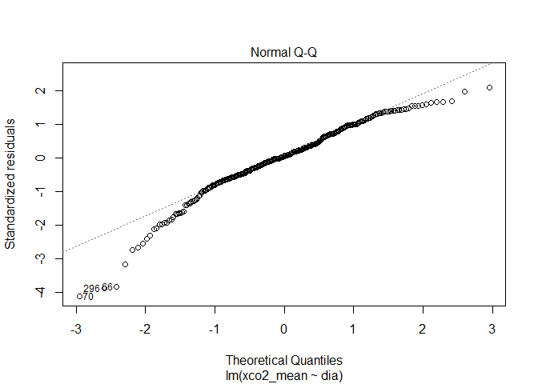
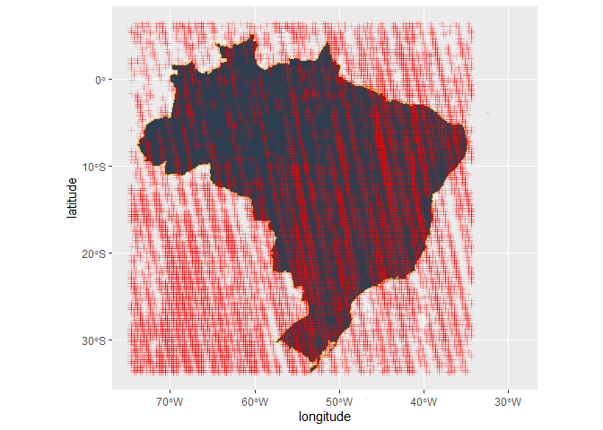
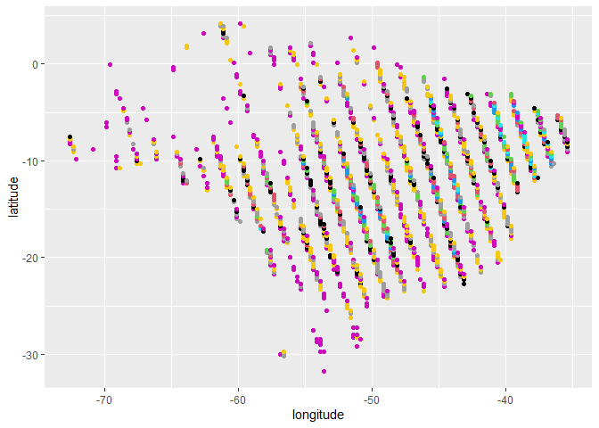
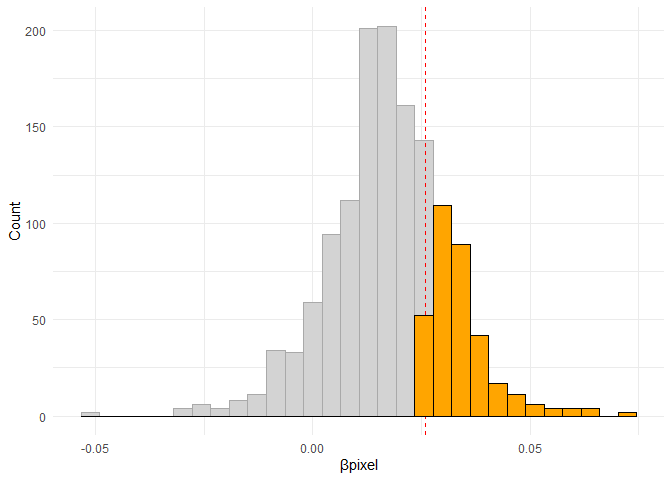
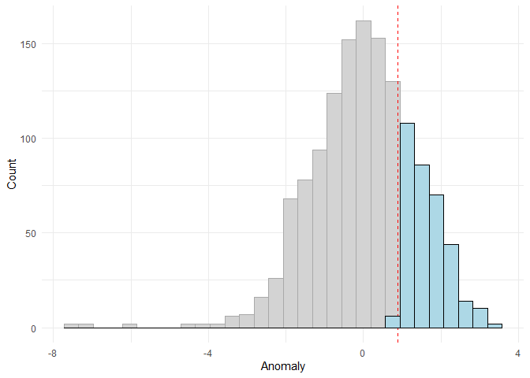
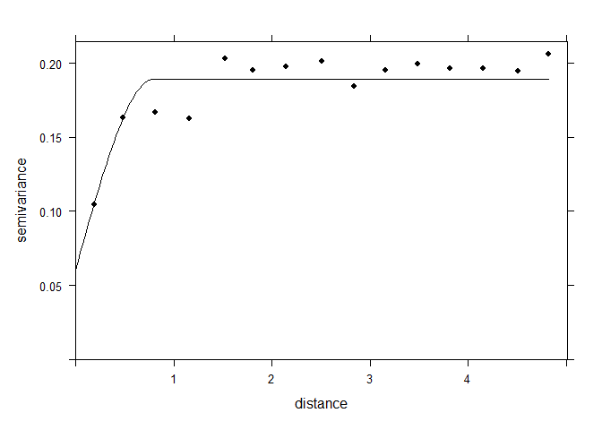
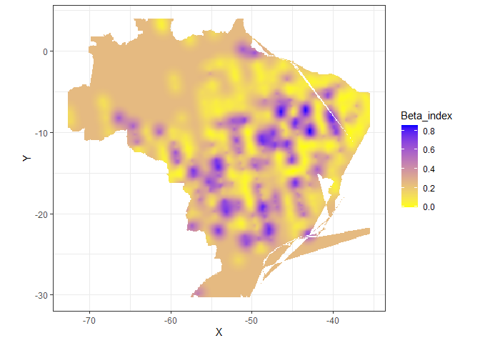

<!-- README.md is generated from README.Rmd. Please edit that file -->

# Determinação de fontes e sumidouros de carbono atmosférico no Brasil por meio da análise de regressão linear

### Aluno: Alan R. Panosso

### Data: 31/08/2021

Projeto final apresentado os instrutores **Athos Damiani** e **Fernando
Correa** da [curso-R](https://curso-r.com/) como parte das exigências
para a finalização do curso de **Regressão Linear** (Trilha de Machine
Learning - Turma Agosto 2021).

## Introdução

As concentrações atmosféricas de gases do efeito estufa (GEE) têm
aumentado a níveis preocupantes. De acordo com a **Organização
Meteorológica Mundial** (*WMO*) as concentrações atmosféricas de dióxido
de carbono (CO<sub>2</sub>), metano (CH<sub>4</sub>) e óxido nitroso
(N<sub>2</sub>O) atingiram novas máximas no ano de 2015 com
CO<sub>2</sub> a 400,0 ± 0,1 ppm, CH<sub>4</sub> em 1845 ± 2 ppb e
N<sub>2</sub>O em 328,0 ± 0,1 ppb, valores que representam,
respectivamente, 144%, 256% e 121% dos níveis pré-industriais ([WMO,
2016](http://ane4bf-datap1.s3-eu-west-1.amazonaws.com/wmocms/s3fs-public/GHG_Bulletin_12_EN_web_JN161640.pdf?aZaKZhdpDfJdmHvtbSvLwbj6zb_PWwdz)).

O Observatório Orbital de Carbono-2 (OCO-2) foi projetado pela **Agência
Espacial Americana** (*National Aeronautics and Space Administration -
NASA*) para apoiar a quantificação e o monitoramento das emissões
antropogênicas de CO<sub>2</sub>.

O satélite OCO-2 foi lançado em julho de 2014 e desde então mede a
concentração de CO<sub>2</sub> atmosférico indiretamente por meio da
intensidade da radiação solar refletida em função da presença de dióxido
de carbono em uma coluna de ar. Essas medições resultam em mapas
espaciais densos e em escala fina de frações molares médias de coluna de
ar seco de dióxido de carbono (X<sub>CO2</sub>).

Nesse contexto, a variação de X<sub>CO2</sub> opode ser modelada por
meio da **análise de regressão linear simples**, uma vez que se espera
um aumento dessas concentrações com o passar do tempo. Em adição, as
estimativas do coeficiente angular **β<sub>1</sub>** fornece informações
importantes para uma determinada região, haja visto que se
**β<sub>1</sub>’** (observado para essa região) for significativamente
maior ao **β<sub>1</sub>** padrão (observado para uma macro-região), tal
área poderá ser considerada uma potencial fonte de carbono para a
atmosfera, caso contrário (**β<sub>1</sub>’** &lt; **β<sub>1</sub>**), a
área em questão poderá ser considerada um sumidouro de CO<sub>2</sub>
atmosférico, mitigando o efeito estufa adicional e, consequentemente, as
mudanças climáticas globais.

## Hipótese e objetivo

A hipótese do projeto é que essa tendência de aumento da concentração
atmosférica de CO<sub>2</sub> pode ser utilizada como um indicativo para
a classificação de áreas como **fontes** ou **sumidouros** de
CO<sub>2</sub> utilizando as estimativas de **β<sub>1</sub>**
provenientes da análise de regressão linear simples.

## Material e Métodos

Para a aquisição de dados será utilizado metodologia desenvolvida e
apresentada anteriormente no curso de R para Ciências de dados 2,
ministrados pela Curso-r ([Projeto Final
r4ds2](https://github.com/arpanosso/projetofinal_r4ds2)), onde foram
utilizadas técnicas de *web scraping* e **faxina de dados** para
obtenção dos valores de X<sub>CO2</sub>.

Breve descrição das variáveis da base:

**longitude**: coordenada geográfica que especifica a posição
leste-oeste de um ponto na superfície da Terra;

**longitude\_bnds**: são, respectivamente, os limites superior e
inferior da coordenada, onde a **longitude** para um ponto foi dada pela
média desses limites;

**latitude**: é uma coordenada geográfica que especifica a posição
norte-sul de um ponto na superfície da Terra;

**latitude\_bnds**: são, respectivamente, os limites superior e inferior
da coordenada, onde a **latitude** para um ponto foi dada pela média
desses limites;

**time\_yyyymmddhhmmss**: data de leitura, em ano, mês, dia, horas
minutos e segundos;

**time\_bnds\_yyyymmddhhmmss**: limites de tempo utilizados para o
cálculo da data de leitura;

**altitude\_km**: altitude média em km;

**alt\_bnds\_km**: limites da altitude, 0 (nível do mar) e altitude do
satélite no momento de leitura;

**fluorescence\_offset\_relative\_771nm\_idp**: Fração de radiância de
nível contínuo explicada por um termo de deslocamento aditivo na janela
espectral de 757 nm (sem unidade);

**fluorescence\_offset\_relative\_757nm\_idp**: Fração da radiância de
nível contínuo explicada por um termo de deslocamento aditivo na janela
espectral de 771 nm (sem unidade);

**xco2\_moles\_mole\_1**: Fração molar de ar seco de CO<sub>2</sub> em
média da coluna.

``` r
oco2 <- readr::read_rds("data/oco2.rds")
dplyr::glimpse(oco2)
#> Rows: 361,615
#> Columns: 11
#> $ longitude                              <dbl> -74.58225, -74.58225, -74.58225~
#> $ longitude_bnds                         <chr> "-74.70703125:-74.4574652778", ~
#> $ latitude                               <dbl> -30.22572489, -29.97654828, -29~
#> $ latitude_bnds                          <chr> "-30.3503131952:-30.1011365845"~
#> $ time_yyyymmddhhmmss                    <dbl> 2.014091e+13, 2.014091e+13, 2.0~
#> $ time_bnds_yyyymmddhhmmss               <chr> "20140909000000:20140910000000"~
#> $ altitude_km                            <dbl> 3307.8, 3307.8, 3307.8, 3307.8,~
#> $ alt_bnds_km                            <chr> "0.0:6615.59960938", "0.0:6615.~
#> $ fluorescence_offset_relative_771nm_idp <dbl> 0.012406800, 0.010696600, -0.00~
#> $ fluorescence_offset_relative_757nm_idp <dbl> -3.58630e+00, 8.81219e-02, -3.6~
#> $ xco2_moles_mole_1                      <dbl> 0.000394333, 0.000395080, 0.000~
```

Será necessário transformar os dados de X<sub>CO2</sub>, para ppm em
seguida criar as variáveis de data a partir da variável
`time_yyyymmddhhmmss`.

``` r
oco2<-oco2 |>
         dplyr::mutate(
           xco2 = xco2_moles_mole_1*1e06,
           data = lubridate::ymd_hms(time_yyyymmddhhmmss),
           year = lubridate::year(data),
           month = lubridate::month(data),
           day = lubridate::day(data),
           dia = difftime(data,"2014-01-09", units = "days"),
           day_week = lubridate::wday(data),
           month_year = lubridate::make_date(year, month, 1) )
```

Existe uma tendência de aumento monotônica mundial da concentração de
CO<sub>2</sub> na atmosfera, assim, ela deve ser modelada para obtermos
**β<sub>1</sub>** para ser considerado o padrão para comparação às
tendências regionais. Devido à periodicidade de retorno do satélite em
um ponto (ao redor de 16 dias) os dados devem ser agrupados pelo mês
dentro de um determinado ano.

``` r
oco2 |> 
  dplyr::filter(year == 2015) |> 
  dplyr::group_by(dia) |> 
  dplyr::summarise(xco2_mean = mean(xco2, na.rm =TRUE)) |> 
  ggplot2::ggplot(ggplot2::aes(x=dia,y=xco2_mean )) +
  ggplot2::geom_point(shape=21,color="black",fill="gray") +
  ggplot2::geom_line(color="red") +
  ggplot2::geom_smooth(method = "lm") +
  ggpubr::stat_regline_equation(ggplot2::aes(
  label =  paste(..eq.label.., ..rr.label.., sep = "*plain(\",\")~~"))) +
  ggplot2::theme_bw()
```

<!-- -->

Para ajustar o modelo linear, usamos `lm()`.

``` r
oco2_aux <- oco2 |> 
  dplyr::filter(year == 2015) |>
  dplyr::group_by(dia) |> 
  dplyr::summarise(xco2_mean = mean(xco2, na.rm =TRUE))
mod <- lm(xco2_mean ~ dia, data = oco2_aux)
br <- mod$coefficients[2] # beta regional
ep <- summary(mod)$coefficients[2,2] # erro padrão
 # limite inferior do Beta regional
limite_inferior_beta_regional <- br - ep

# limite superior do Beta regional
limite_superior_beta_regional <- br + ep
```

Vamos olhar o diagnóstico da análise.

``` r
broom::augment(mod, interval="confidence")
#> # A tibble: 317 x 10
#>    xco2_mean dia   .fitted .lower .upper .resid   .hat .sigma .cooksd .std.resid
#>        <dbl> <drt>   <dbl>  <dbl>  <dbl>  <dbl>  <dbl>  <dbl>   <dbl>      <dbl>
#>  1      391. 357.~    392.   392.   392. -0.812 0.0134   1.22 3.06e-3     -0.672
#>  2      393. 358.~    392.   392.   392.  1.29  0.0133   1.22 7.60e-3      1.06 
#>  3      393. 359.~    392.   392.   392.  1.00  0.0131   1.22 4.58e-3      0.829
#>  4      393. 360.~    392.   392.   392.  0.854 0.0130   1.22 3.29e-3      0.706
#>  5      392. 361.~    392.   392.   392.  0.204 0.0129   1.22 1.86e-4      0.168
#>  6      392. 366.~    392.   392.   392. -0.389 0.0124   1.22 6.50e-4     -0.322
#>  7      393. 367.~    392.   392.   392.  0.573 0.0123   1.22 1.40e-3      0.473
#>  8      393. 368.~    392.   392.   392.  0.879 0.0122   1.22 3.26e-3      0.726
#>  9      392. 369.~    392.   392.   392.  0.352 0.0121   1.22 5.19e-4      0.291
#> 10      393. 370.~    392.   392.   392.  1.19  0.0120   1.22 5.89e-3      0.985
#> # ... with 307 more rows
plot(mod)
```

<!-- --><!-- --><!-- --><!-- -->

``` r
cooks.distance(mod)
#>            1            2            3            4            5            6 
#> 3.055247e-03 7.597057e-03 4.580254e-03 3.292568e-03 1.859488e-04 6.499081e-04 
#>            7            8            9           10           11           12 
#> 1.395253e-03 3.256227e-03 5.185250e-04 5.886842e-03 3.603522e-06 5.516671e-04 
#>           13           14           15           16           17           18 
#> 8.850543e-04 2.806128e-03 1.350571e-03 1.352814e-06 6.925387e-04 3.456922e-03 
#>           19           20           21           22           23           24 
#> 2.092351e-03 7.621595e-04 1.395225e-02 2.648997e-03 2.675939e-04 2.984946e-06 
#>           25           26           27           28           29           30 
#> 1.563528e-03 4.901811e-04 1.995668e-03 9.084349e-03 5.843687e-03 2.077896e-03 
#>           31           32           33           34           35           36 
#> 1.760198e-03 3.571221e-03 9.101033e-03 3.812346e-04 8.390584e-03 2.005749e-04 
#>           37           38           39           40           41           42 
#> 3.926647e-03 5.876160e-03 1.352124e-02 1.498654e-02 7.068567e-03 1.146305e-03 
#>           43           44           45           46           47           48 
#> 1.888846e-02 2.555641e-04 5.158430e-03 1.940192e-04 2.861215e-02 3.983845e-02 
#>           49           50           51           52           53           54 
#> 6.439778e-04 7.267364e-03 1.766793e-03 2.623932e-05 5.367644e-06 4.639781e-04 
#>           55           56           57           58           59           60 
#> 1.132913e-03 1.251678e-02 1.424559e-02 3.885648e-06 2.679798e-04 6.501314e-04 
#>           61           62           63           64           65           66 
#> 2.208402e-03 2.121131e-04 3.573741e-03 8.706761e-04 9.375163e-04 4.898626e-02 
#>           67           68           69           70           71           72 
#> 1.222203e-03 2.448546e-02 7.243650e-07 5.476660e-02 8.777554e-03 1.047693e-03 
#>           73           74           75           76           77           78 
#> 9.163364e-04 1.213957e-02 1.756302e-02 7.231332e-04 4.357834e-04 6.094724e-06 
#>           79           80           81           82           83           84 
#> 1.932321e-02 7.714448e-04 6.727077e-05 4.733975e-03 8.841795e-07 6.233330e-04 
#>           85           86           87           88           89           90 
#> 4.719103e-05 8.251322e-04 4.749394e-03 4.614332e-03 6.587137e-04 8.577621e-06 
#>           91           92           93           94           95           96 
#> 9.731794e-04 7.944171e-05 8.122349e-05 2.038396e-03 2.016680e-03 2.129724e-04 
#>           97           98           99          100          101          102 
#> 1.119951e-06 1.483962e-04 7.735784e-05 1.010943e-04 2.697623e-03 8.782719e-05 
#>          103          104          105          106          107          108 
#> 1.094433e-04 1.803959e-04 1.683447e-03 1.075276e-04 3.332941e-03 2.553531e-05 
#>          109          110          111          112          113          114 
#> 1.666449e-05 1.734787e-03 2.074535e-03 5.185004e-03 1.804371e-03 5.281733e-03 
#>          115          116          117          118          119          120 
#> 1.827251e-03 2.530600e-03 3.833097e-04 8.532830e-04 8.289624e-04 1.800869e-03 
#>          121          122          123          124          125          126 
#> 8.261726e-04 5.410450e-04 3.386293e-03 7.617568e-03 1.339824e-03 1.323014e-03 
#>          127          128          129          130          131          132 
#> 3.150965e-04 6.371985e-03 9.730021e-04 1.999290e-03 1.383460e-03 2.387345e-03 
#>          133          134          135          136          137          138 
#> 1.676880e-03 6.818059e-04 2.915351e-03 4.782992e-04 3.015790e-03 2.435112e-04 
#>          139          140          141          142          143          144 
#> 1.173490e-03 7.952517e-04 2.726686e-03 4.292316e-03 2.510919e-03 3.847819e-03 
#>          145          146          147          148          149          150 
#> 3.328335e-03 3.942858e-03 2.327937e-03 3.486587e-03 3.052312e-03 3.846841e-03 
#>          151          152          153          154          155          156 
#> 6.136751e-04 2.179549e-03 1.545625e-03 2.048557e-06 3.243162e-03 7.573242e-05 
#>          157          158          159          160          161          162 
#> 2.610463e-03 3.099234e-03 1.494351e-03 3.275413e-03 1.392188e-04 3.305571e-03 
#>          163          164          165          166          167          168 
#> 2.411267e-03 5.202507e-04 4.023833e-03 2.633894e-07 3.176671e-03 3.406761e-04 
#>          169          170          171          172          173          174 
#> 9.798096e-04 7.062379e-04 9.203146e-06 1.689173e-03 2.030393e-04 3.123383e-03 
#>          175          176          177          178          179          180 
#> 3.266551e-04 1.478282e-03 6.243266e-04 8.765316e-04 1.588683e-04 2.017707e-03 
#>          181          182          183          184          185          186 
#> 1.545060e-03 4.403041e-05 4.057039e-03 6.459277e-04 4.231227e-04 7.805765e-06 
#>          187          188          189          190          191          192 
#> 1.072661e-03 8.872802e-04 1.653733e-04 3.329200e-03 6.823652e-04 1.051280e-03 
#>          193          194          195          196          197          198 
#> 1.980442e-05 7.718141e-06 4.839467e-04 1.756631e-04 9.177032e-05 2.073792e-05 
#>          199          200          201          202          203          204 
#> 7.124094e-03 4.066240e-04 6.172188e-06 1.078655e-04 1.835665e-03 4.935996e-06 
#>          205          206          207          208          209          210 
#> 1.280712e-05 2.268246e-05 1.293692e-03 1.504142e-04 2.547836e-05 2.620210e-05 
#>          211          212          213          214          215          216 
#> 1.095968e-07 1.573884e-04 2.438335e-04 2.471376e-06 1.291552e-04 8.870286e-04 
#>          217          218          219          220          221          222 
#> 1.961707e-03 2.268347e-04 1.732516e-06 8.410656e-05 2.009838e-04 4.866213e-04 
#>          223          224          225          226          227          228 
#> 4.516526e-05 8.259732e-04 1.410293e-03 6.136655e-03 3.234320e-04 7.513052e-05 
#>          229          230          231          232          233          234 
#> 4.082083e-04 1.294844e-04 3.179133e-03 2.507150e-03 1.055601e-03 2.887959e-05 
#>          235          236          237          238          239          240 
#> 1.996825e-03 7.461275e-05 1.461838e-05 2.616779e-04 3.717024e-03 2.133591e-03 
#>          241          242          243          244          245          246 
#> 7.753288e-03 2.918223e-03 8.795129e-07 4.355446e-04 4.210778e-04 1.175078e-04 
#>          247          248          249          250          251          252 
#> 5.395151e-04 4.123921e-05 5.564857e-03 9.889962e-05 3.070257e-05 2.451659e-05 
#>          253          254          255          256          257          258 
#> 8.146741e-04 1.197111e-04 7.264636e-06 2.163958e-03 6.435351e-05 9.541303e-03 
#>          259          260          261          262          263          264 
#> 1.599980e-02 2.724419e-03 1.854510e-03 7.370544e-03 1.287532e-03 3.584743e-03 
#>          265          266          267          268          269          270 
#> 2.191274e-03 6.155308e-04 4.255415e-03 6.615302e-04 3.611688e-04 3.615010e-04 
#>          271          272          273          274          275          276 
#> 4.825631e-03 2.217225e-02 3.402189e-06 4.926265e-06 1.812464e-05 1.914446e-04 
#>          277          278          279          280          281          282 
#> 2.051160e-03 6.859079e-04 3.809780e-03 1.522015e-03 1.664252e-02 7.383826e-03 
#>          283          284          285          286          287          288 
#> 2.327033e-03 9.724409e-07 1.515583e-04 2.439975e-03 3.263679e-03 5.762377e-04 
#>          289          290          291          292          293          294 
#> 1.220151e-04 5.633927e-04 7.224024e-05 7.610696e-04 2.161567e-05 7.820580e-03 
#>          295          296          297          298          299          300 
#> 6.254593e-04 7.875021e-02 1.184216e-03 8.799616e-04 1.085939e-03 2.896817e-04 
#>          301          302          303          304          305          306 
#> 5.132459e-03 2.182456e-03 1.423779e-02 9.297009e-04 1.598796e-04 3.991303e-06 
#>          307          308          309          310          311          312 
#> 2.487110e-03 3.138805e-03 3.225408e-03 3.021315e-04 2.630219e-03 1.591272e-02 
#>          313          314          315          316          317 
#> 1.351446e-04 5.807543e-03 1.264129e-02 7.193662e-05 3.172273e-03
```

A próxima operação é selecionarmos na base de dados somente os pontos
pertencentes ao território brasileiro. Assim vamos utilizar o pacote
`{geobr}` para criarmos o filtro a partir dos polígonos das diferentes
regiões do Brasil.

``` r
regiao <- geobr::read_region(showProgress = FALSE)
#> Loading required namespace: sf
#> Using year 2010
br <- geobr::read_country(showProgress = FALSE)
#> Using year 2010
```

Agora podemos extrair os polígonos.

``` r
### Polígono Brasil
pol_br <- br$geom |> purrr::pluck(1) |> 
  as.matrix()

### Polígonos das Regiões
pol_norte <- regiao$geom |> purrr::pluck(1) |> 
  as.matrix()
pol_nordeste <- regiao$geom |> purrr::pluck(2) |> 
  as.matrix()
pol_sudeste <- regiao$geom |> purrr::pluck(3) |> 
  as.matrix()
pol_sul <- regiao$geom |> purrr::pluck(4) |> 
  as.matrix()
pol_centroeste<- regiao$geom |> purrr::pluck(5) |> 
  as.matrix()
```

``` r
# Retirando alguns pontos
# pol_br <- pol_br[pol_br[,1]<=-34,]
# pol_br <- pol_br[!((pol_br[,1]>=-38.8 & pol_br[,1]<=-38.6) &
#                               (pol_br[,2]>= -19 & pol_br[,2]<= -16)),]

pol_nordeste <- pol_nordeste[pol_nordeste[,1]<=-34,]
pol_nordeste <- pol_nordeste[!((pol_nordeste[,1]>=-38.7 & pol_nordeste[,1]<=-38.6) & pol_nordeste[,2]<= -15),]
```

Plot de todos os pontos.

``` r
 br |>
   ggplot2::ggplot() +
   ggplot2::geom_sf(fill="#2D3E50", color="#FEBF57",
           size=.15, show.legend = FALSE) +
   ggplot2::geom_point(data=oco2 |> dplyr::filter(year == 2014) ,
              ggplot2::aes(x=longitude,y=latitude),
              shape=3,
              col="red",
              alpha=0.2)
```

<!-- -->

Definindo uma função para criar as flags das diferentes regiões e da
amazônia legal

``` r
def_pol <- function(x, y, pol){
  as.logical(sp::point.in.polygon(point.x = x,
                                  point.y = y,
                                  pol.x = pol[,1],
                                  pol.y = pol[,2]))
}
```

Vamos criar o filtro para os pontos pertencentes ao polígono do Brasil,
demais regiões e da amazônia legal. Devemos salientar que esses dados
estão com a tendência de aumento ao longo do tempo, posteriormete vamos
salvar esses dados para posterior disponibilização.

``` r
# oco2 <- oco2 |>
#           dplyr::mutate(
#             flag_br = def_pol(longitude, latitude, pol_br),
#             flag_norte = def_pol(longitude, latitude, pol_norte),
#             flag_nordeste = def_pol(longitude, latitude, pol_nordeste),
#             flag_sul = def_pol(longitude, latitude, pol_sul),
#             flag_sudeste = def_pol(longitude, latitude, pol_sudeste),
#             flag_centroeste = def_pol(longitude, latitude, pol_centroeste)
#           )
# dplyr::glimpse(oco2)
```

Pra garantir a reprodutibilidade desse material, vamos
salvar/disponibilizar os dados na base `oco2_br_trend.rds`, somente com
os pontos dentro do território nacional.

``` r
 # readr::write_rds(oco2 |>
 #                    dplyr::mutate(flag_br = flag_br | flag_nordeste) |> 
 #                    dplyr::filter(flag_br) |> 
 #                    dplyr::select(-flag_br)
 #                  , "data/oco2_br_trend.rds")
```

Vamos ler o banco de dados *\[com a tendência\]*.

``` r
oco2_br_trend <- readr::read_rds("data/oco2_br_trend.rds")
```

Devemos criar a análise para um ano específico, pois a comparação do
artigo será ano a ano.

``` r
oco2_nest <- oco2_br_trend |>
  dplyr::filter(year == 2015) |> 
  tibble::as_tibble() |> 
  dplyr::mutate(quarter = lubridate::quarter(data),
                quarter_year = lubridate::make_date(year, quarter, 1)) |>   tidyr::pivot_longer(
    starts_with("flag"),
    names_to = "region",
    values_to = "flag",
  ) |> 
  dplyr::filter(flag) |> 
  dplyr::mutate(region = stringr::str_remove(region,"flag_")) |> 
  dplyr::group_by(region, longitude, latitude, dia) |> 
  dplyr::summarise(xco2_mean = mean(xco2, na.rm=TRUE)) |> 
  dplyr::mutate(
    regi = region,
    id_time = dia
  ) |> 
  dplyr::group_by(region, latitude, longitude) |> 
  tidyr::nest() 
#> `summarise()` has grouped output by 'region', 'longitude', 'latitude'. You can override using the `.groups` argument.
```

Função para construção da análise de regressão linear para cada pixel, e
diagnósticos.

``` r
linear_reg <- function(df, output="beta1"){
  # Modelo para cada pixel
  modelo <- lm(xco2_mean ~ dia, data=df)
  beta_1 <- c(summary(modelo)$coefficients[2])
  
  # Definindo o modelo
  if(output=="beta1"){ 
    return(beta_1)
  }
  
  # Salvando o valor P
  if(output=="p_value"){
    if(is.nan(beta_1)){
      beta_1 <- 0
      p <- 1
    }else{
      p <- summary(modelo)$coefficients[2,4]
      if(is.nan(p)) p <- 1
    }
    return(p)
  }
  
  # Criando gráfico
  if(output=="plot"){
    plot <- df |> 
      ggplot2::ggplot(ggplot2::aes(x=dia,y=xco2_mean)) +
      ggplot2::geom_point() +
      ggplot2::theme_bw()
    return(plot)
  }
  if(output=="hist"){
    hist <- df |> 
      ggplot2::ggplot(ggplot2::aes(x=xco2_mean, y=..density..)) +
      ggplot2::geom_histogram(bins=10, color="black", fill="lightgray") +
      ggplot2::geom_density()+
      ggplot2::theme_bw()
    return(hist)
  }
  
  # Anomalia é o Xco2 do regional menos o Xco2 do pixel, melhor é o contrário.
  if(output == "partial"){
     partial <- df |> 
       dplyr::summarise(xco2 = mean(xco2_mean), na.mr=TRUE) |> 
       dplyr::pull(xco2)
     return(partial)
  }
  
    if(output == "n"){
     return(nrow(df))
   }
}
```

Vamos aplicar a função para cada ponto de amostragem do satélite
(pixel).

``` r
oco2_nest <- oco2_nest |> 
  dplyr::mutate( 
    beta_line = purrr::map(data,linear_reg, output="beta1"),
    p_value = purrr::map(data,linear_reg, output="p_value"),
    partial = purrr::map(data,linear_reg, output="partial"),
    n_obs = purrr::map(data,linear_reg, output="n")
    #plot = purrr::map(data,linear_reg, output="plot"),
    #hist = purrr::map(data,linear_reg, output="hist")
  )
```

``` r
# oco2_nest |> 
#   dplyr::filter(region == "norte") |> 
#   dplyr::filter(p_value < 0.05, beta_line < 0) |> 
#   dplyr::pull(plot)
```

``` r
oco2_nest |> 
  # dplyr::filter(p_value < 0.05) |>
  dplyr::filter(n_obs > 5) |> 
  # dplyr::mutate(class = ifelse(beta_line > limite_inferior_beta_regional,
  #                              1,ifelse(beta_line < limite_inferior_beta_regional, -1, 0))
  #               ) |> 
  dplyr::select(longitude, latitude, n_obs) |> 
  ggplot2::ggplot(ggplot2::aes(x=longitude, y=latitude, color = n_obs)) +
  ggplot2::geom_point()
```

<!-- -->

``` r
oco2_aux <- oco2_nest |> 
  # dplyr::filter(region == "norte") |> 
  # dplyr::filter(p_value < 0.05) |> 
  dplyr::filter(n_obs > 7) |> 
  tidyr::unnest(cols = c(beta_line, partial)) |>
  dplyr::ungroup() |>
  dplyr::select(longitude, latitude, beta_line, partial)

q3_oco2 <- oco2_aux |> dplyr::pull(beta_line) |> quantile(.75)

oco2_aux <- oco2_aux |> 
  dplyr::mutate(
    anomaly =  partial - oco2_aux |> 
      dplyr::pull(partial) |>  
      mean(),
    Dbeta = beta_line - oco2_aux |> 
      dplyr::pull(beta_line) |> mean(na.rm=TRUE)
  )
q3_anom <- oco2_aux |> dplyr::pull(anomaly) |> quantile(.75)


oco2_aux <- oco2_aux |> 
  dplyr::mutate(
    beta_index =  ifelse(beta_line <=q3_oco2, 0, 1)
  )

# Mapeando
oco2_aux |> 
  ggplot2::ggplot(ggplot2::aes(x=longitude, y=latitude) ) + 
  ggplot2::geom_point()
```

<!-- -->

``` r
oco2_aux |> 
  ggplot2::ggplot(ggplot2::aes(x=beta_line)) +
  ggplot2::geom_histogram(bins=30,
                          fill="orange",
                          color="black") +
  ggplot2::labs(x="βpixel",y="Count") +
  ggplot2::geom_vline(xintercept = q3_oco2,
                      color = "red",
                      lty=2) +
  gghighlight::gghighlight(beta_line > q3_oco2,
                           unhighlighted_params = list(
                               color = "darkgray",
                               fill = "lightgray")) +
  ggplot2::theme_minimal()
#> Warning: Could not calculate the predicate for layer 2; ignored
```

<!-- -->

``` r
# oco2_aux |> 
#   ggplot2::ggplot(ggplot2::aes(x=anomaly)) +
#   ggplot2::geom_histogram(bins=30,
#                           fill="lightblue",
#                           color="black") +
#   ggplot2::labs(x="Anomaly",y="Count") +
#   ggplot2::geom_vline(xintercept = q3_anom,
#                       color = "red",
#                       lty=2) +
#   gghighlight::gghighlight(anomaly > q3_anom,
#                            unhighlighted_params = list(
#                                color = "darkgray",
#                                fill = "lightgray")) +
#   ggplot2::theme_minimal()
```

``` r
sp::coordinates(oco2_aux)=~ longitude+latitude  
form_beta<-beta_line~1
form_anom<-anomaly~1
form_index<-beta_index~1
```

### Semivariograma para beta

``` r
vari_beta <- gstat::variogram(form_beta, data=oco2_aux)
m_beta <- gstat::fit.variogram(vari_beta,fit.method = 7,
                               gstat::vgm(1, "Sph", 6, 1))
plot(vari_beta,model=m_beta, col=1,pl=F,pch=16)
```

<!-- -->

### Semivariograma para anomalia

``` r
vari_anom<-gstat::variogram(form_anom, data=oco2_aux)
m_anom <- gstat::fit.variogram(vari_anom,gstat::vgm(.8,"Sph",9,.2))
plot(vari_anom, model=m_anom, col=1,pl=F,pch=16)
```

<!-- -->

### Semivariograma para beta\_index

``` r
vari_index <- gstat::variogram(form_index, data=oco2_aux)
m_index <- gstat::fit.variogram(vari_index,fit.method = 7,
                               gstat::vgm(1, "Sph", 6, 1))
plot(vari_index,model=m_index, col=1,pl=F,pch=16)
```

<!-- -->

``` r
x<-oco2_aux$longitude
y<-oco2_aux$latitude
dis <- .1 #Distância entre pontos
grid <- expand.grid(X=seq(min(x),max(x),dis), Y=seq(min(y),max(y),dis))
sp::gridded(grid) = ~ X + Y
```

``` r
ko_beta<-gstat::krige(formula=form_beta, oco2_aux, grid, model=m_beta, 
    block=c(1,1),
    nsim=0,
    na.action=na.pass,
    debug.level=-1,  
    )
#> [using ordinary kriging]
#>   0% done  1% done  2% done  3% done  4% done  5% done  6% done  7% done  8% done  9% done 10% done 11% done 12% done 13% done 14% done 15% done 16% done 17% done 18% done 19% done 20% done 21% done 22% done 23% done 24% done 25% done 26% done 27% done 28% done 29% done 30% done 31% done 32% done 33% done 34% done 35% done 36% done 37% done 38% done 39% done 40% done 41% done 42% done 43% done 44% done 45% done 46% done 47% done 48% done 49% done 50% done 51% done 52% done 53% done 54% done 55% done 56% done 57% done 58% done 59% done 60% done 61% done 62% done 63% done 64% done 65% done 66% done 67% done 68% done 69% done 70% done 71% done 72% done 73% done 74% done 75% done 76% done 77% done 78% done 79% done 80% done 81% done 82% done 83% done 84% done 85% done 86% done 87% done 88% done 89% done 90% done 91% done 92% done 93% done 94% done 95% done 96% done 97% done 98% done 99% done100% done

ko_anom<-gstat::krige(formula=form_anom, oco2_aux, grid, model=m_anom, 
    block=c(0,0),
    nsim=0,
    na.action=na.pass,
    debug.level=-1,  
    )
#> [using ordinary kriging]
#>   0% done  1% done  2% done  3% done  4% done  5% done  6% done  7% done  8% done  9% done 10% done 11% done 12% done 13% done 14% done 15% done 16% done 17% done 18% done 19% done 20% done 21% done 22% done 23% done 24% done 25% done 26% done 27% done 28% done 29% done 30% done 31% done 32% done 33% done 34% done 35% done 36% done 37% done 38% done 39% done 40% done 41% done 42% done 43% done 44% done 45% done 46% done 47% done 48% done 49% done 50% done 51% done 52% done 53% done 54% done 55% done 56% done 57% done 58% done 59% done 60% done 61% done 62% done 63% done 64% done 65% done 66% done 67% done 68% done 69% done 70% done 71% done 72% done 73% done 74% done 75% done 76% done 77% done 78% done 79% done 80% done 81% done 82% done 83% done 84% done 85% done 86% done 87% done 88% done 89% done 90% done 91% done 92% done 93% done 94% done 95% done 96% done 97% done 98% done 99% done100% done

ko_index<-gstat::krige(formula=form_index, oco2_aux, grid, model=m_index, 
    block=c(0,0),
    nsim=0,
    na.action=na.pass,
    debug.level=-1,  
    )
#> [using ordinary kriging]
#>   0% done  1% done  2% done  4% done  5% done  6% done  7% done  8% done 10% done 11% done 12% done 13% done 14% done 15% done 16% done 17% done 18% done 19% done 20% done 21% done 22% done 23% done 24% done 25% done 26% done 27% done 28% done 29% done 30% done 31% done 32% done 33% done 34% done 35% done 36% done 37% done 38% done 39% done 40% done 41% done 42% done 43% done 44% done 45% done 46% done 47% done 48% done 49% done 50% done 51% done 52% done 53% done 54% done 55% done 56% done 57% done 58% done 59% done 60% done 61% done 62% done 63% done 64% done 65% done 66% done 67% done 68% done 69% done 70% done 71% done 72% done 73% done 74% done 75% done 76% done 77% done 78% done 79% done 80% done 81% done 82% done 83% done 84% done 85% done 86% done 87% done 88% done 89% done 90% done 91% done 92% done 93% done 94% done 95% done 96% done 97% done 98% done 99% done100% done
```

``` r
tibble::as_tibble(ko_beta) |> 
  dplyr::mutate(flag_br = def_pol(X,Y,pol_br),
                flag_nordeste = def_pol(X,Y,pol_nordeste)) |> 
  dplyr::filter(flag_br | flag_nordeste) |> 
  ggplot2::ggplot(ggplot2::aes(x=X, y=Y),color="black") + 
  ggplot2::geom_tile(ggplot2::aes(fill = var1.pred)) +
  ggplot2::scale_fill_gradient(low = "yellow", high = "blue") + 
  ggplot2::coord_equal()+
  ggplot2::labs(fill="βpixel") +
  ggplot2::theme_bw()
```

<!-- -->

``` r
tibble::as_tibble(ko_index) |> 
  dplyr::mutate(flag_br = def_pol(X,Y,pol_br),
                flag_nordeste = def_pol(X,Y,pol_nordeste)) |> 
  dplyr::filter(flag_br | flag_nordeste) |> 
  ggplot2::ggplot(ggplot2::aes(x=X, y=Y),color="black") + 
  ggplot2::geom_tile(ggplot2::aes(fill = var1.pred)) +
  ggplot2::scale_fill_gradient(low = "yellow", high = "blue") + 
  ggplot2::coord_equal()+
  ggplot2::labs(fill="Beta_index") +
  ggplot2::theme_bw()
```

<!-- -->

``` r
tibble::as_tibble(ko_anom) |> 
  dplyr::mutate(flag_br = def_pol(X,Y,pol_br),
                flag_nordeste = def_pol(X,Y,pol_nordeste)) |> 
  dplyr::filter(flag_br | flag_nordeste) |> 
  ggplot2::ggplot(ggplot2::aes(x=X, y=Y),color="black") + 
  ggplot2::geom_tile(ggplot2::aes(fill = var1.pred)) +
  ggplot2::scale_fill_gradient(low = "yellow", high = "blue") + 
  ggplot2::coord_equal()+
  ggplot2::labs(fill="Anomaly") +
  ggplot2::theme_bw()
```

<!-- -->
